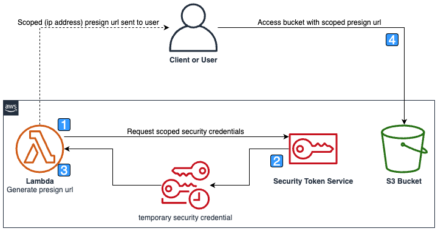

# Presigned URL Using Temporary Conditional Credentials for Amazon S3
This is a CDK stack written in TypeScript that sets up an AWS infrastructure to create [Amazon S3](https://aws.amazon.com/s3/) [presigned URLs](https://docs.aws.amazon.com/AmazonS3/latest/userguide/ShareObjectPreSignedURL.html) with a conditional policy. An [AWS Lambda](https://aws.amazon.com/pm/lambda/) is executed with an S3 object name and IP address as parameters. The Lambda will assume a role using the [AWS Security Token Service](https://docs.aws.amazon.com/STS/latest/APIReference/welcome.html) with an additional policy which limits access to the S3 bucket via a condition statement. The Lambda then generates and returns a presigned URL using the assumed role which restricts access to the S3 Object to a given IP address. This example scopes permissions to a given IP address, though it can be modified to scope permissions to any [S3 condition](https://docs.aws.amazon.com/AmazonS3/latest/userguide/using-presigned-url.html) such as SourceVpc. The credentials created by this sample are temporary and have a [maximum session duration](https://docs.aws.amazon.com/IAM/latest/UserGuide/id_roles_use.html#id_roles_use_view-role-max-session) which will effect the maximum presigned url expire time.

## Overview

<br><br>

## Execution Steps

1. The Lambda is invoked with the required bucket object and end user/client IP address to scope permissions.
2. The security token service returns temporary security credentials with a conditional policy to restrict access to a specific IP address
3. The Lambda generates an S3 presigned URL with the temporary credentials returned
4. The client/User uses the presigned URL from the required IP address to access the S3 bucket

## Components
The stack creates the following resources:

- An AWS Lambda to assume the role and generate the presigned url
- An S3 bucket which holds the objects
- An [AWS Identity and Access Management Role](https://docs.aws.amazon.com/IAM/latest/UserGuide/id_roles.html) the Lambda can assume to grant access to the S3 bucket


## Requirements
- [AWS CDK](https://aws.amazon.com/cdk/)
- Node.js (>= 10.3.0)
- [AWS CLI](https://docs.aws.amazon.com/cli/latest/userguide/cli-chap-welcome.html)

## Setup
1. Clone the repository.
2. Install dependencies by running `npm install`.
3. Build the TypeScript code by running `npm run build`.
4. Test the TypeScript code by running `npm test`.
5. Deploy the stack to AWS by running `cdk deploy`.

## Usage
Once the stack is deployed, you can execute the Lambda function to produce a presigned URL with a specific IP address. Using the presigned URL you can access the `demo.html` file via your web browser.

The sample Lambda function can be triggered manually by running the following command:

```sh
aws lambda invoke --function-name [FUNCTION_NAME] --payload '{ "objectKey": "demo.html", "sourceIp": "[IP_ADDRESS]" }' --output text --cli-binary-format raw-in-base64-out outfile.txt
```

View the outfile.txt file to retrieve the presigned URL.

## Configuration
The following environment variables can be set to customize the behavior of the stack:

- **CDK_SAMPLE_STACK_ID**: The Stack ID. Defaults to `PresignedUrlUsingTemporaryConditionalCredentialsForAmazonS3Stack`
- **CDK_SAMPLE_ACCOUNT**: The account this stack will deploy into. Defaults to `CDK_DEFAULT_ACCOUNT`.
- **CDK_SAMPLE_REGION**: The region this stack will deploy into. Defaults to `CDK_DEFAULT_REGION`.

## Clean Up
1. Remove the stack from AWS by running `cdk destroy`.


## Security

See [CONTRIBUTING](CONTRIBUTING.md#security-issue-notifications) for more information.

## License

This library is licensed under the MIT-0 License. See the LICENSE file.

